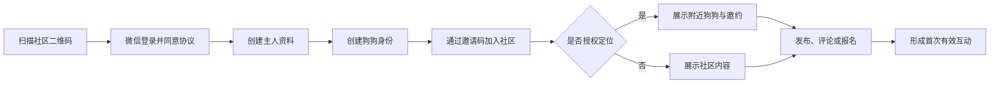
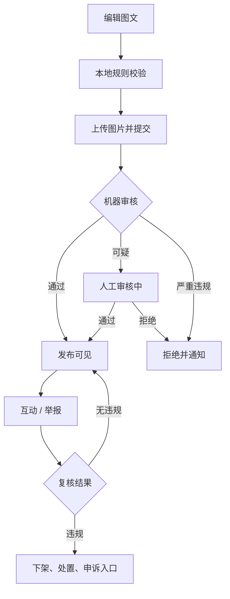
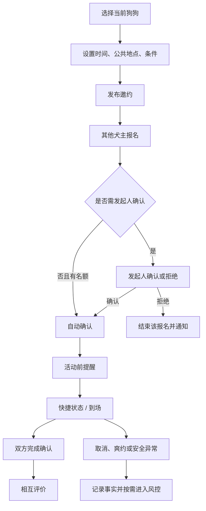
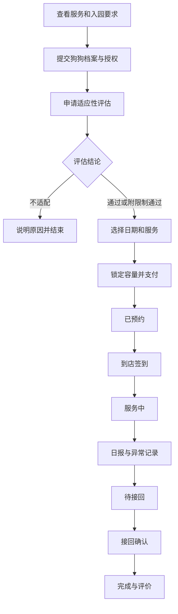

# 信息架构、页面清单与核心流程

## 1. 小程序信息架构

```text
小程序
├── 社区
│   ├── 推荐 / 关注
│   ├── 动态详情
│   ├── 狗狗主页
│   └── 官方活动
├── 附近
│   ├── 附近狗狗
│   ├── 今日可约
│   ├── 遛狗邀约
│   └── 公共遛狗地点
├── 发布（动作入口）
│   ├── 晒宠动态
│   ├── 遛狗邀约
│   └── 社区活动（有权限角色）
├── 幼儿园
│   ├── 门店与服务
│   ├── 入园评估
│   ├── 预约订单
│   └── 日报与评价
└── 我的
    ├── 主人 / 狗狗档案
    ├── 内容与关系
    ├── 邀约 / 活动 / 订单
    ├── 通知中心
    └── 隐私、安全与账号
```

“发布”是中间动作按钮，不需要独立落地页；点击后弹出角色允许的发布类型。

## 2. 完整页面清单

### 2.1 公共与入驻

| ID | 页面 | P级 | 主要内容 |
|---|---|---|---|
| ONB-01 | 品牌启动页 | P0 | 初始化、登录态检查 |
| ONB-02 | 登录与协议 | P0 | 微信登录、用户协议、隐私政策 |
| ONB-03 | 创建主人资料 | P0 | 昵称、头像、必要声明 |
| ONB-04 | 创建狗狗档案 | P0 | 分步填写基础与社交信息 |
| ONB-05 | 加入社区 | P0 | 邀请码、扫码来源、社区选择 |
| ONB-06 | 定位与附近可见授权 | P0 | 分项授权、用途说明、稍后设置 |
| ONB-07 | 引导完成 | P0 | 推荐下一步：浏览/首发 |

### 2.2 社区

| ID | 页面 | P级 | 主要内容 |
|---|---|---|---|
| COM-01 | 社区首页 | P0 | 推荐/关注、社区切换、通知入口 |
| COM-02 | 动态详情 | P0 | 正文、图片、点赞、评论、举报 |
| COM-03 | 发布动态 | P0 | 图片、正文、可见社区 |
| COM-04 | 评论回复 | P0 | 一级评论/回复、删除、举报 |
| COM-05 | 狗狗主页 | P0 | 公开档案、动态、关注关系 |
| COM-06 | 关注列表 | P1 | 关注与被关注狗狗 |
| COM-07 | 收藏列表 | P1 | 收藏动态 |
| COM-08 | 官方活动详情 | P1 | 规则、报名、状态 |

### 2.3 附近与邀约

| ID | 页面 | P级 | 主要内容 |
|---|---|---|---|
| NEA-01 | 附近首页 | P0 | 狗狗/邀约切换、模糊距离、筛选 |
| NEA-02 | 附近筛选 | P0 | 距离档、时间、体型、性格 |
| NEA-03 | 公共地点列表/详情 | P0 | 公共集合区域、安全提示 |
| WLK-01 | 邀约列表 | P0 | 日期、区域、剩余名额、条件 |
| WLK-02 | 邀约详情 | P0 | 发起狗、条件、参与列表、报名 |
| WLK-03 | 发起邀约 | P0 | 结构化字段与安全确认 |
| WLK-04 | 报名确认 | P0 | 选择狗狗、条件核对、声明 |
| WLK-05 | 报名管理 | P0 | 发起人确认/拒绝 |
| WLK-06 | 活动快捷状态 | P0 | 准时、晚到、已到、取消等 |
| WLK-07 | 完成确认 | P0 | 到场/未到/异常事实 |
| WLK-08 | 相互评价 | P0 | 结构化评价、举报入口 |
| WLK-09 | 邀约取消/异常 | P0 | 原因、影响、申诉 |

### 2.4 幼儿园

| ID | 页面 | P级 | 主要内容 |
|---|---|---|---|
| DAY-01 | 幼儿园首页 | P0 | 门店介绍、营业时间、入园要求 |
| DAY-02 | 服务项目详情 | P0 | 价格、时长、包含服务、取消规则 |
| DAY-03 | 入园档案与授权 | P0 | 服务所需健康/行为信息 |
| DAY-04 | 评估申请 | P0 | 可选时间、特殊说明 |
| DAY-05 | 评估结果 | P0 | 通过/不适配/限制与有效期 |
| DAY-06 | 日期与容量 | P0 | 可预约日期、剩余情况 |
| DAY-07 | 订单确认与支付 | P0 | 服务快照、价格、协议 |
| DAY-08 | 订单详情 | P0 | 状态时间线、取消/退款入口 |
| DAY-09 | 托管日报 | P0 | 照片、饮食、活动、排泄、备注 |
| DAY-10 | 异常事件详情 | P0 | 事件、处置、联系记录 |
| DAY-11 | 接回确认 | P0 | 接回人确认、完成服务 |
| DAY-12 | 服务评价 | P0 | 评分、标签、文字 |

### 2.5 我的与设置

| ID | 页面 | P级 | 主要内容 |
|---|---|---|---|
| ME-01 | 我的首页 | P0 | 当前狗狗、快捷入口、通知未读 |
| ME-02 | 主人资料 | P0 | 公开昵称与头像 |
| ME-03 | 狗狗管理 | P0 | 新增、编辑、切换、删除 |
| ME-04 | 狗狗档案编辑 | P0 | 基础/社交/健康分区 |
| ME-05 | 我的动态 | P0 | 发布内容管理 |
| ME-06 | 我的邀约 | P0 | 发起/参与与状态 |
| ME-07 | 我的订单 | P0 | 评估/托管/退款 |
| ME-08 | 通知中心 | P0 | 分类、已读、跳转 |
| ME-09 | 隐私设置 | P0 | 附近可见、授权记录 |
| ME-10 | 黑名单 | P0 | 查看与解除 |
| ME-11 | 举报记录 | P1 | 进度与结果摘要 |
| ME-12 | 账号与注销 | P0 | 协议、注销、数据说明 |

### 2.6 运营后台

| 模块 | P级 | 页面/能力 |
|---|---|---|
| 登录与权限 | P0 | 强认证、角色、会话 |
| 工作台 | P0 | 待审核、严重事件、异常订单 |
| 社区 | P0 | 社区、邀请码、认证、公共地点 |
| 用户与狗狗 | P0 | 查询、脱敏详情、处罚、申诉 |
| 内容 | P0 | 审核队列、下架、举报证据 |
| 邀约 | P0 | 查询、取消、异常与纠纷 |
| 幼儿园 | P0 | 门店只读总览、异常升级 |
| 通知 | P0 | 系统通知模板与发送记录 |
| 配置 | P0 | 审核词、枚举、活动规则 |
| 审计 | P0 | 操作日志查询与导出审批 |
| 数据 | P1 | 漏斗、留存、安全与服务看板 |

### 2.7 幼儿园工作台

| 模块 | P级 | 页面/能力 |
|---|---|---|
| 今日工作台 | P0 | 待评估、到店、服务中、待接回 |
| 狗狗档案 | P0 | 经授权的服务必要字段 |
| 评估 | P0 | 排期、结论、限制、有效期 |
| 容量 | P0 | 日期/服务容量和占用 |
| 订单 | P0 | 状态、签到、服务、接回 |
| 日报 | P0 | 模板录入、图片上传、发送 |
| 异常 | P0 | 严重级别、处置、触达、升级 |
| 售后 | P0 | 取消、退款建议、投诉协同 |
| 服务配置 | P1 | 项目、价格、要求 |
| 员工与排班 | P1 | 账号与权限 |

## 3. 核心用户流程

### 3.1 冷启动与首次价值



关键兜底：定位拒绝不阻断入驻；档案可分步保存，但进入邀约或幼儿园前必须补齐对应必填字段。

### 3.2 发布与审核



### 3.3 遛狗邀约



### 3.4 幼儿园服务



## 4. 导航与跨页规则

- 当前狗狗常驻全局状态；执行发帖、报名、预约前再次展示身份确认。
- 通知深链必须先做权限和资源状态检查，失效资源展示解释页而非空白页。
- 分享卡片不得带精确位置、健康字段、私人联系方式或后台鉴权参数。
- 页面返回后刷新受影响局部状态，支付/报名等关键页面不得仅依赖前端缓存。
- 所有危险或不可逆动作使用二次确认并说明后果；支付、取消、注销由服务端最终裁决。
