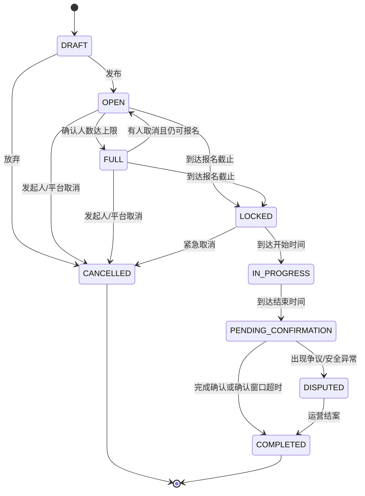
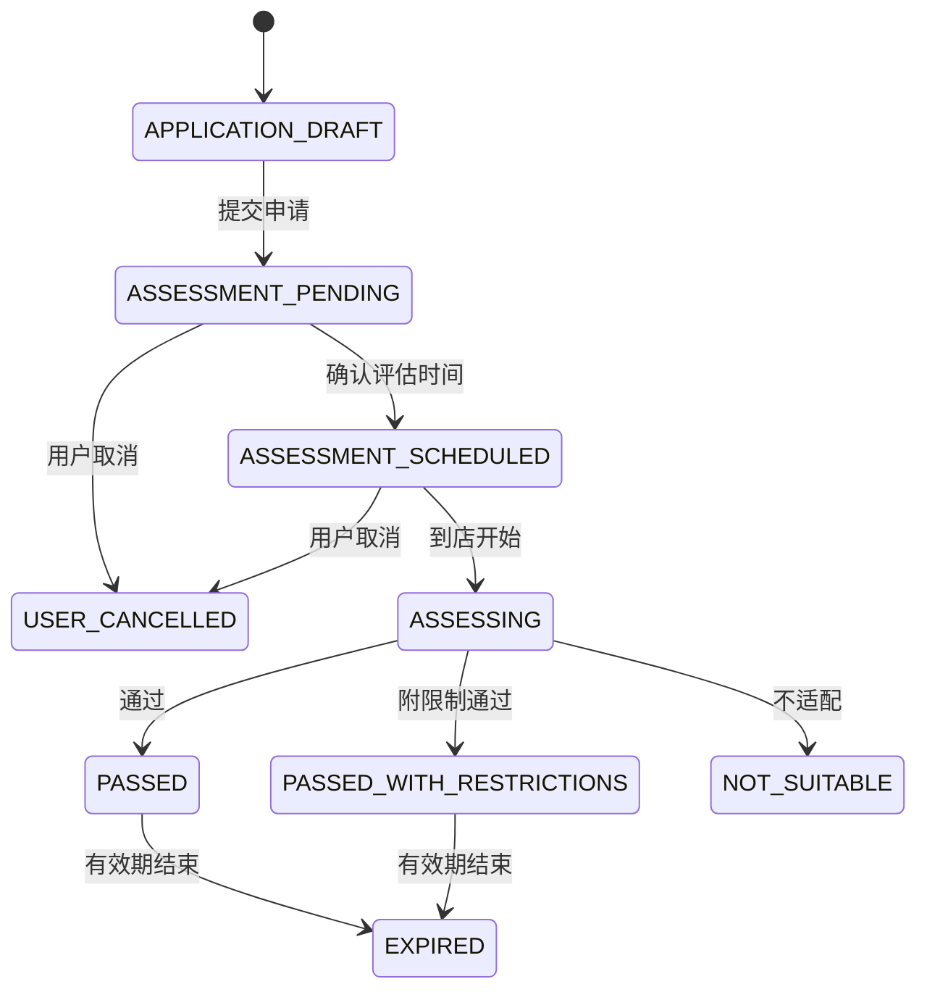
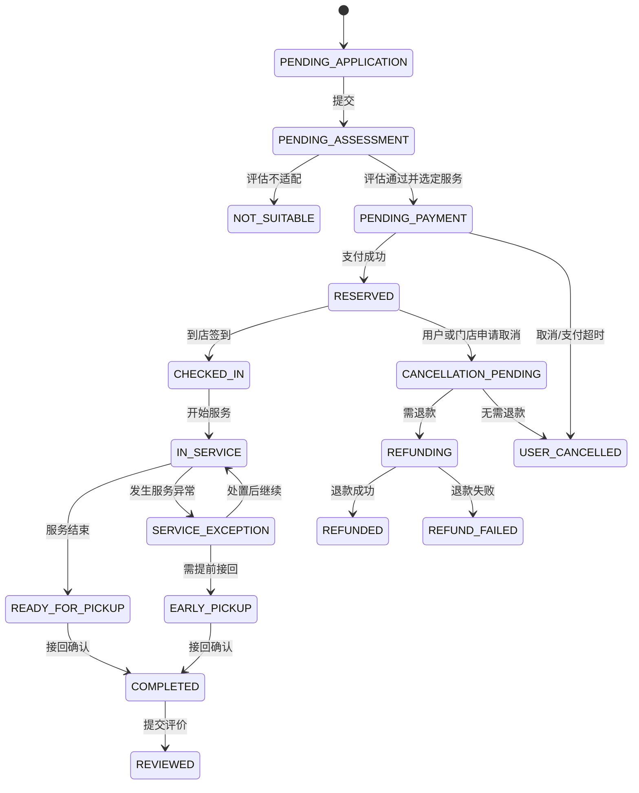

# 狗狗身份字段与业务状态机

## 1. 字段分级

- L0 公开：在社区规则和隐私设置允许时展示。
- L1 社交受限：仅登录且满足社区/附近规则的用户可见。
- L2 服务敏感：仅主人及获得特定服务授权的员工可见。
- L3 高敏感：严格最小权限、加密存储、访问审计，不用于公开展示。

## 2. 狗狗身份字段

### 2.1 基础字段

| 字段 | 类型/示例 | 必填 | 分级 | 规则 |
|---|---|---:|---|---|
| dog_id | UUID | 是 | 系统 | 不可枚举 |
| owner_id | UUID | 是 | 系统 | 不对外返回 |
| name | string(20) | 是 | L0 | 审核 |
| avatar_asset_id | UUID | 是 | L0 | 审核后的图片 |
| album_asset_ids | UUID[] | 否 | L0 | 数量后台配置 |
| breed_code | enum | 是 | L0 | 允许“混血/未知” |
| sex | male/female/unknown | 是 | L0 | — |
| birth_date | date | 否 | L1 | 公开页可转成年龄 |
| weight_kg | decimal | 否 | L1 | 公开页可展示区间 |
| size | small/medium/large | 是 | L0 | 口径固定 |
| neutered | yes/no/unknown | 否 | L1 | — |
| community_id | UUID | 是 | L1 | 对外展示社区名称，不返回内部 ID |
| public_owner_name | string(20) | 是 | L0 | 不等于微信实名 |
| profile_status | draft/active/deleted | 是 | 系统 | 删除为逻辑状态 |

### 2.2 社交与行为字段

| 字段 | 类型 | 必填场景 | 分级 | 说明 |
|---|---|---|---|---|
| personality_tags | enum[] | 档案 | L0 | 活泼、安静、慢热等 |
| human_affinity | 1..5/unknown | 邀约 | L1 | 亲人程度 |
| dog_affinity | 1..5/unknown | 邀约 | L1 | 亲狗程度 |
| activity_level | low/medium/high | 邀约 | L0 | — |
| fears_large_dogs | boolean/unknown | 邀约 | L1 | — |
| food_guarding | boolean/unknown | 邀约/服务 | L2 | 公开只显示“有特别相处提示” |
| chasing_behavior | boolean/unknown | 邀约/服务 | L2 | 同上 |
| aggression_history | none/declared/under_review | 邀约/服务 | L2 | 不展示事件细节 |
| compatible_sizes | enum[] | 否 | L1 | — |
| play_styles | enum[] | 否 | L0 | 追逐、嗅闻、轻柔玩耍等 |
| walk_time_slots | structured[] | 否 | L1 | 星期 + 时段 |
| favorite_place_ids | UUID[] | 否 | L1 | 只能选公共地点 |
| looking_for_walk_partner | boolean | 否 | L1 | 可独立关闭 |
| nearby_visible | boolean | 否 | L1 | 默认关闭，主动开启 |

### 2.3 健康、安全与紧急字段

| 字段 | 类型 | 分级 | 公开派生值 |
|---|---|---|---|
| vaccine_status | unsubmitted/pending/confirmed/expired/rejected | L2 | 仅“疫苗信息已确认” |
| rabies_vaccine_date | date | L2 | 不公开 |
| vaccine_proof_asset_ids | UUID[] | L3 | 不公开 |
| deworming_records | structured[] | L2 | 不公开 |
| allergies | encrypted text/enum[] | L2 | 不公开 |
| medical_conditions | encrypted text | L3 | 不公开 |
| care_instructions | encrypted text | L2 | 不公开 |
| diet_and_medication | encrypted text | L3 | 不公开 |
| emergency_contact_name | encrypted string | L3 | 不公开 |
| emergency_contact_phone | encrypted string | L3 | 不公开 |
| emergency_consent | structured | L3 | 不公开 |

### 2.4 认证与系统字段

| 字段 | 类型 | 说明 |
|---|---|---|
| community_verification | status + verified_at | 社区认证 |
| vaccine_verification | status + expires_at | 与原始凭证分离 |
| daycare_verification | status + store_id | 到店认证 |
| civilized_owner_badge | status + issued_at | 文明养犬认证 |
| created_at/updated_at/deleted_at | timestamp | 审计字段 |
| created_by/updated_by | principal_id | 操作者 |
| profile_version | integer | 乐观锁与授权快照 |

## 3. 邀约模型字段

邀约至少包含：发起狗狗、社区、公共地点、日期、开始/结束时间、最大狗狗数、体型要求、性格要求、行为排除项、注意事项、是否审批、取消临界时间、状态、版本号。

报名至少包含：邀约、参与狗狗、申请状态、条件快照、申请/决定时间、决定人、取消原因、到场事实、完成事实、异常引用。

## 4. 遛狗邀约状态机

### 4.1 邀约主状态



| 状态 | 中文 | 可执行动作 |
|---|---|---|
| DRAFT | 草稿 | 编辑、发布、删除 |
| OPEN | 可报名 | 报名、审批、取消 |
| FULL | 已满员 | 已报名者取消、发起人取消 |
| LOCKED | 报名截止 | 快捷状态、紧急取消 |
| IN_PROGRESS | 进行中 | 到场状态、异常上报 |
| PENDING_CONFIRMATION | 待完成确认 | 到场/完成事实、评价草稿 |
| DISPUTED | 争议处理中 | 补充证据、运营处理 |
| COMPLETED | 已完成 | 评价、查看结果 |
| CANCELLED | 已取消 | 查看原因、按规则记取消事实 |

### 4.2 报名状态

```text
PENDING（待确认）
  → CONFIRMED（已确认）
  → ATTENDED / NO_SHOW / CANCELLED（到场 / 爽约 / 已取消）
PENDING → REJECTED / CANCELLED
CONFIRMED → CANCELLED / REMOVED
```

- 自动确认只在无需审批、满足条件且容量原子扣减成功时发生。
- `NO_SHOW` 不由单方评价直接写入；需双方事实、平台规则或运营复核。
- 发起人移除已确认成员必须选择原因并通知；临近活动的异常移除进入风控抽样。

### 4.3 快捷状态

`ON_TIME`、`LATE_10_MIN`、`ARRIVED`、`CANNOT_ATTEND`、`DOG_UNWELL`、`REQUEST_CANCEL`。快捷状态是事件，不替代报名或邀约主状态。

## 5. 幼儿园评估与订单状态机

### 5.1 评估状态



评估是独立实体；订单引用有效评估及限制快照。

### 5.2 订单主状态



### 5.3 异常与投诉采用正交子状态

订单主状态之外记录：

- `exception_status`: NONE / OPEN / CONTAINED / CLOSED；
- `complaint_status`: NONE / SUBMITTED / PROCESSING / RESOLVED / APPEALED / CLOSED；
- `payment_status`: UNPAID / PROCESSING / PAID / FAILED / PARTIALLY_REFUNDED / REFUNDED；
- `refund_status`: NONE / REQUESTED / APPROVED / PROCESSING / SUCCEEDED / FAILED / REJECTED。

这样可避免“投诉处理中”覆盖“服务已完成”等业务事实。

### 5.4 状态迁移约束

- 只有有效评估才能从待评估进入待支付。
- 支付回调以微信交易号幂等，前端“支付成功”不能直接改订单状态。
- 签到、服务开始、日报、异常、待接回和接回必须由授权门店员工操作。
- 退款结果以支付渠道回调或主动查询为准。
- 每次迁移写入状态历史：旧状态、新状态、操作者、原因、时间、请求幂等键。
