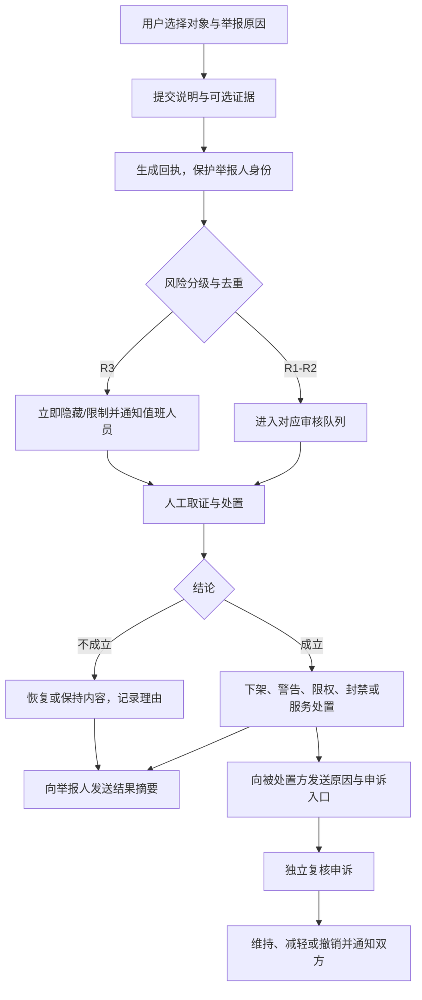

# 平台权限、内容安全与举报处理

## 1. 权限设计原则

- 默认拒绝，按角色、资源归属、社区/门店范围和数据敏感级别共同授权。
- 前端隐藏不等于权限控制，所有鉴权由服务端执行。
- 高敏感字段按具体服务授权，授权包含用途、门店、有效期和可见字段。
- 管理端查询也需资源范围；超级管理员不用于日常运营。
- 查看原始健康凭证、导出、处罚、退款、角色变更均写审计。

## 2. 权限矩阵

符号：`自`=本人/名下狗狗，`社`=授权社区，`店`=本门店，`全`=平台授权范围，`—`=无权限。

| 资源/动作 | 犬主 | 主理人 | 审核员 | 运营 | 幼儿园员工 | 店长 | 客服/风控 | 超管 |
|---|---:|---:|---:|---:|---:|---:|---:|---:|
| 主人公开资料查看 | 社 | 社 | 全 | 全 | 店/订单 | 店/订单 | 工单 | 全 |
| 主人资料编辑 | 自 | 自 | — | — | — | — | — | 受控 |
| 狗狗公开档案查看 | 社/附近 | 社 | 全 | 全 | 店/订单 | 店/订单 | 工单 | 全 |
| 狗狗档案编辑 | 自 | 自 | — | — | 服务记录 | 服务记录 | — | 受控 |
| 健康摘要查看 | 自 | — | — | 脱敏 | 店/授权 | 店/授权 | 工单/授权 | 审批 |
| 原始健康凭证 | 自 | — | — | — | 评估/授权 | 评估/授权 | 严重工单 | 审批 |
| 发布普通动态 | 自 | 自 | — | 官方 | — | 官方账号 | — | — |
| 发布官方活动 | — | 社 | — | 全 | — | 店 | — | — |
| 内容审核/下架 | — | — | 全 | 全 | — | — | 工单建议 | 全 |
| 举报提交 | 自 | 自 | — | — | 店 | 店 | — | — |
| 举报处理 | — | — | 内容类 | 全 | — | — | 安全/投诉 | 全 |
| 用户处罚 | — | — | 建议 | 全 | — | — | 建议/紧急限制 | 全 |
| 社区与公共地点配置 | — | 建议 | — | 全 | — | — | — | 全 |
| 邀约报名/取消 | 自 | 自 | — | 纠纷处置 | — | — | 工单 | 受控 |
| 入园评估 | 申请/查看 | — | — | 只读 | 店 | 店 | 工单 | 全 |
| 订单状态操作 | 自有动作 | — | — | 异常处置 | 店 | 店 | 售后 | 全 |
| 容量与服务配置 | — | — | — | 只读 | 查看 | 店 | — | 全 |
| 退款发起/审批 | 申请 | — | — | 规则内审批 | 建议 | 建议/审批 | 售后审批 | 全 |
| 审计日志查看 | 自身授权记录 | — | 自身操作 | 授权范围 | 自身操作 | 店 | 工单 | 全 |
| 角色与权限管理 | — | — | — | — | — | 店内低权限 | — | 全 |

生产建议将退款资金审批与订单服务操作分离；大额或例外退款采用双人复核。

## 3. 内容安全范围

### 3.1 禁止内容

- 虐待、伤害动物或鼓励危险养犬；
- 宠物交易、违禁动物交易、婚配导流；
- 色情、暴力、仇恨、诈骗、赌博和违法内容；
- 公开手机号、微信号、精确住址、门牌、实时位置等导流或隐私信息；
- 冒充认证、虚假健康信息、伪造幼儿园报告；
- 骚扰、威胁、曝光他人隐私；
- 对犬种、主人或社区成员的人身攻击；
- 未经授权的儿童正脸、证件、病历等敏感内容。

### 3.2 审核层级

| 风险 | 示例 | 默认动作 | SLA |
|---|---|---|---|
| R0 正常 | 日常晒宠 | 自动通过 + 抽检 | 即时 |
| R1 低风险 | 疑似联系方式、轻微不文明 | 限流或待复核 | 24 小时 |
| R2 中风险 | 骚扰、隐私曝光、疑似交易 | 先隐藏后复核 | 4 小时 |
| R3 高风险 | 虐待、威胁、诈骗、严重安全事件 | 立即阻断、保全证据、账号临时限制、升级 | 15 分钟响应 |

SLA 为待业务确认的建议值。

## 4. 举报处理流程

### 4.1 举报对象

动态、评论、狗狗主页、邀约、评价、幼儿园日报/服务、用户账号、线下行为与安全事件。不同对象进入不同专业队列。

### 4.2 处理要求

- 举报提交后立即生成不可猜测的 report_id 和结果查询入口。
- 审核员只见必要证据；举报人身份默认不向被举报人披露。
- 重复举报合并但保留独立提交事实，防止刷量影响自动处罚。
- 下架与账号处罚分离：内容违规不必然封号，严重安全风险可先临时限制。
- 线下人身或宠物紧急风险显示明确的线下紧急处置提示；平台保全证据并转专人。
- 申诉原则上由非原处理人复核，结果与理由均写审计。

## 5. 拉黑、防骚扰与位置安全

- 拉黑后双方不能关注、评论、回复、报名对方新邀约或在附近互相发现。
- 既有共同邀约：若尚未开始，提示冲突并交由运营/发起人处理；服务订单不因拉黑中断。
- 评论、发布、关注、报名和举报均有用户/IP/设备/资源维度频控。
- 文本和图片检测联系方式、门牌和二维码；命中后阻止发布或进入复核。
- 精确坐标只用于服务端短时计算；持久化采用加密坐标或低精度网格并设保留周期。
- API 只返回距离档位（如 500m 内、1–3km）和公共区域，不返回方向、轨迹或住宅地标。
- 用户可关闭附近可见，关闭后从新查询中即时排除，缓存须在短时间内失效。

## 6. 宠物与线下安全

- 发起/报名邀约前确认行为信息真实、牵引责任和公共场地规则。
- 攻击历史、护食等仅作为匹配和安全判断，不公开标签羞辱。
- 平台记录取消、爽约、到场和异常事实；处罚需结合频次、证据与申诉。
- 幼儿园异常分一般、重要、严重：严重事件要求即时联系主人、店长与平台值班人员。
- 日报和异常附件设置访问时效、防盗链和水印；禁止公开分享敏感报告。

## 7. 账号处罚建议

| 级别 | 动作 | 场景 |
|---|---|---|
| 提醒 | 内容修改/规则教育 | 首次低风险 |
| 内容限制 | 下架、短期禁发/禁评 | 重复内容违规 |
| 社交限制 | 禁止发起/报名邀约 | 爽约、骚扰、虚假行为信息 |
| 服务限制 | 暂停预约，要求复评 | 服务安全资料不实 |
| 临时冻结 | 冻结高风险能力待调查 | 严重安全举报 |
| 永久封禁 | 禁止登录或核心能力 | 经核实的严重违法、虐待、诈骗 |

处罚必须包含规则依据、有效期、影响能力、证据引用和申诉通道。

## 8. 隐私与数据生命周期

- 收集前展示目的、范围、保存期和拒绝影响；健康、定位、订阅消息分别授权。
- 订单创建时保存授权快照；订单结束后员工访问按保存政策自动收回。
- 注销前处理未结订单、退款、举报与法定留存；完成后公开资料去标识化。
- 备份中的删除通过到期轮换实现，恢复备份后重新执行删除清单。
- 数据导出默认脱敏、有审批、有水印、有到期时间。
