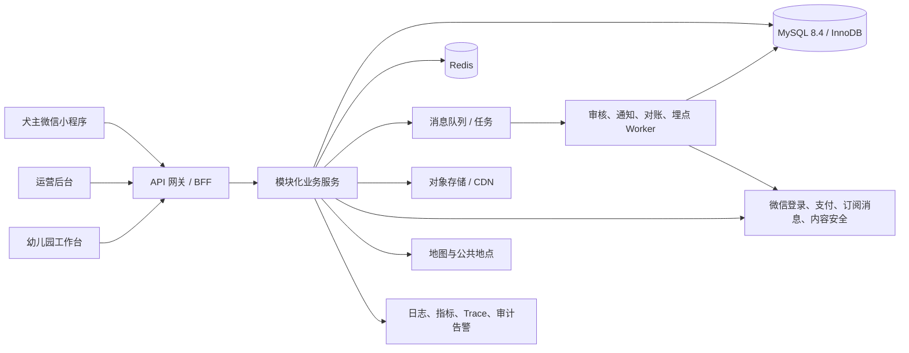
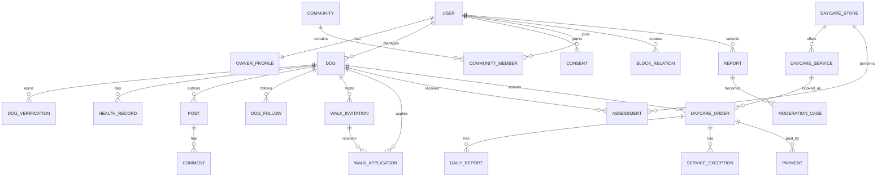

# 技术架构建议与数据库核心实体

## 1. 架构决策

MVP 建议采用“模块化单体 + 异步任务”，不在单社区阶段拆微服务。业务边界在代码与数据库模型中明确，等容量、团队和变更频率证明有必要时再拆分。

### 推荐技术栈

| 层 | 建议 | 原因 |
|---|---|---|
| 小程序 | 原生微信小程序 + TypeScript | 微信能力兼容性与包体可控 |
| 管理前端 | Vue 3 或 React + TypeScript | 团队择熟；运营与工作台共用组件库 |
| 服务端 | Java/Spring Boot 或 Node.js/NestJS | 团队择熟；需强类型、事务和成熟鉴权 |
| 数据库 | MySQL 8.4 LTS（InnoDB） | 开发者已有经验，事务成熟，单人维护成本较低 |
| 缓存/锁 | Redis | 会话、频控、容量锁、热点数据 |
| 对象存储 | 云对象存储 + CDN | 图片、凭证、日报附件分桶和签名 URL |
| 队列 | 云消息队列 | 审核、通知、支付同步、埋点 |
| 地图 | 腾讯位置服务 | 微信生态、公共地点检索 |
| 可观测 | 日志 + 指标 + Trace + 告警 | 核心链路定位与审计 |

云厂商与具体框架在确认现有团队能力、微信资质和预算后冻结。

## 2. 系统上下文

## 3. 后端模块

| 模块 | 职责 |
|---|---|
| Identity | 微信身份、会话、协议、注销 |
| Owner & Dog | 主人与狗狗档案、认证、授权 |
| Community | 社区、邀请码、成员、公共地点 |
| Content | 动态、评论、点赞、收藏、关注 |
| Nearby | 定位授权、网格、模糊距离、筛选 |
| Walk | 邀约、报名、快捷状态、完成、评价 |
| Daycare | 门店、服务、评估、容量、订单、日报、异常 |
| Payment | 支付单、回调、退款、对账 |
| Notification | 站内通知、订阅消息、模板和重试 |
| Trust & Safety | 审核、举报、拉黑、处罚、申诉 |
| Admin & IAM | 后台账号、角色、资源范围 |
| Analytics | 业务事件、投递和质量校验 |
| Audit | 高风险访问与状态变更日志 |

模块之间通过应用接口调用；支付、审核、通知和埋点采用 Outbox 事件异步解耦。

## 4. 关键实现策略

### 4.1 鉴权和敏感数据

- 小程序登录换取服务端短期会话；管理端使用强认证和更短会话。
- RBAC 决定功能权限，ABAC 校验 owner_id、community_id、store_id、订单关系和授权范围。
- 健康、电话、紧急联系人采用字段级加密，密钥与数据库分离。
- 原图私有存储，通过短期签名 URL 访问；不同敏感级别使用不同存储前缀/桶策略。

### 4.2 位置

- 客户端坐标经服务端转换为 Geohash 网格或距离档；列表响应不含原始坐标。
- 公共集合点由平台维护，邀约只保存 place_id 和当时名称/区域快照。
- MVP 附近查询先按 Geohash 前缀或社区范围粗筛，再使用 `ST_Distance_Sphere` 计算距离并返回模糊档位；数据量增长后可将 `POINT` 列设为 `NOT NULL` 并增加 `SPATIAL INDEX`。
- 拉黑、隐身、社区规则在距离计算后统一过滤；接口始终不返回原始坐标。

### 4.3 一致性和幂等

- 创建报名、容量占用、支付回调、退款回调使用唯一约束 + 幂等键。
- 订单状态迁移在数据库事务内校验当前版本并追加状态历史。
- 业务写入和异步消息使用事务 Outbox，Worker 至少一次消费，消费者去重。
- 容量表采用日期/服务维度行锁或原子条件更新，禁止 `used > capacity`。

### 4.4 审核和媒体

- 客户端直传对象存储前先获取受限上传凭证；上传完成后服务端校验 MIME、大小和哈希。
- 媒体先进入隔离区，机器审核通过后转为可分发状态。
- 内容记录只引用 media_asset，不直接信任客户端 URL。

## 5. 核心实体关系

## 6. 核心表

### 身份与社区

- `users`：微信主体映射、账号状态、账号分类。
- `owner_profiles`：公开昵称、头像。
- `dogs`：基础与社交字段、隐私开关、版本。
- `dog_health_records`：加密健康与照护字段，独立权限。
- `dog_verifications`：认证类型、状态、有效期、审核主体。
- `consents`：授权类型、版本、用途、范围、起止时间、撤回。
- `communities`、`community_members`、`invite_codes`、`public_places`。

### 内容与关系

- `posts`、`media_assets`、`comments`；
- `post_likes`、`post_collections`、`dog_follows`；
- `block_relations`；
- 关键唯一约束：一只狗对同一动态最多一个有效点赞/收藏；同一关注边唯一。

### 邀约

- `walk_invitations`：主状态、条件 JSON、容量、公共地点快照、版本。
- `walk_applications`：报名状态、条件快照、决定与取消事实。
- `walk_status_events`：快捷状态。
- `walk_attendance`：到场与完成事实、来源、争议状态。
- `walk_reviews`：评价与安全标记。
- `walk_state_history`：每次主状态迁移。

### 幼儿园与支付

- `daycare_stores`、`daycare_services`、`daycare_service_prices`；
- `assessments`：结论、限制、有效期、评估人；
- `daycare_capacity`：service_id + service_date 唯一，capacity/held/confirmed；
- `daycare_orders`：主状态、服务/价格/规则/评估快照、版本；
- `daily_reports`、`service_exceptions`、`pickup_confirmations`、`daycare_reviews`；
- `payments`、`payment_callbacks`、`refunds`、`reconciliation_records`；
- `order_state_history`。

### 治理、通知与审计

- `moderation_results`、`reports`、`moderation_cases`、`appeals`、`penalties`；
- `notifications`、`notification_deliveries`、`subscription_preferences`；
- `admin_users`、`roles`、`permissions`、`role_bindings`；
- `audit_logs`、`outbox_events`、`analytics_events`。

## 7. 索引与约束重点

- 内部主键优先使用 `BIGINT UNSIGNED AUTO_INCREMENT`；外部接口另设不可枚举的 `public_id`（建议 UUIDv7/ULID，以 `BINARY(16)` 或定长字符串存储）。
- `walk_applications(invitation_id, dog_id)` 有效记录唯一。
- `daycare_capacity(service_id, service_date)` 唯一并有非负检查约束。
- 支付渠道交易号、回调 ID、退款单号唯一。
- 高频列表按 `(community_id, status, created_at desc)`、`(owner_id, status, updated_at desc)` 建索引。
- MySQL 不使用 PostgreSQL 式部分索引。需要“仅未删除记录唯一”时，优先保留不可重复的关系记录并切换状态；确需删除后重建时，使用可索引的生成列，例如未删除时生成业务键、已删除时生成 `NULL`，再对生成列建立唯一索引。
- JSON 只保存低频、可扩展的条件快照；社区、体型、状态、时间等查询字段必须独立成列并建立普通索引。确需按 JSON 属性检索时，使用生成列或多值索引，不把 JSON 当作核心关系模型。
- 经纬度不进入普通分析表、日志或客户端缓存。

## 8. API 设计约定

- REST/JSON 或团队统一规范；写请求接受 `Idempotency-Key`。
- 状态更新携带 `version`，冲突返回 409 并要求刷新。
- 错误返回稳定 code、可读 message、trace_id，不泄露内部堆栈。
- 列表采用游标分页；后台导出采用异步任务和短期下载地址。
- DTO 按场景定义：公开狗狗、本人狗狗、邀约匹配、幼儿园授权档案互不复用。

## 9. 环境与发布

- dev、test、staging、production 账号、数据库、对象存储、微信配置完全隔离。
- 密钥进入密钥管理服务，不写入代码仓库、镜像或日志。
- 数据库迁移向前兼容：先添加可空字段或新表、部署兼容代码并回填，再切换读写，最后择期清理；大表 DDL 上线前确认 MySQL 在线 DDL 能力和锁表风险。
- 基础设施、告警、权限角色和审计策略均代码化并纳入评审。

## 10. MySQL 单人开发基线

- 使用 MySQL 8.4 LTS、InnoDB、`utf8mb4`；所有业务表显式声明主键。
- 生产环境优先使用云厂商托管 MySQL，开启自动备份、时间点恢复、慢查询日志和基础监控，减少单人运维负担。
- 默认隔离级别可沿用 InnoDB 的 `REPEATABLE READ`，但报名容量、库存和状态迁移仍必须使用明确的条件更新、唯一约束或 `SELECT ... FOR UPDATE`，不能依赖前端判断。
- 时间统一存 UTC；金额使用最小货币单位整数，不使用浮点类型。
- 数据库字符集统一为 `utf8mb4`，排序规则在建库时固定，避免昵称、犬名和搜索结果在不同环境下口径不一致。
- 备份不是完成标准，必须在测试环境定期执行恢复演练。
